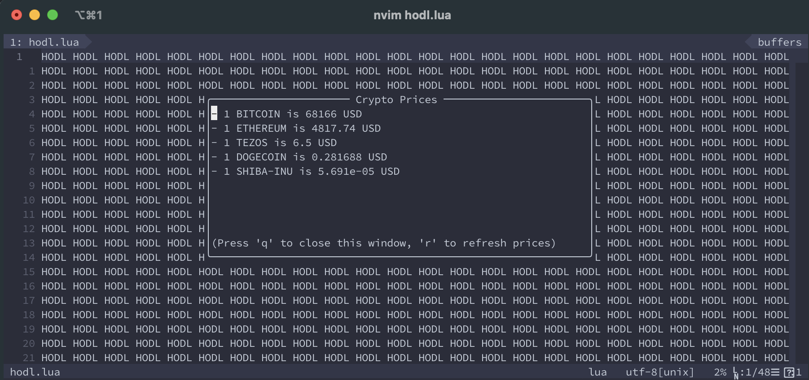

# Crypto Price NeoVim

There are a [million](https://upload.wikimedia.org/wikipedia/en/1/16/Drevil_million_dollars.jpg) ways to check the price of your favourite coins. Now I made a `nvim` plugin with which you can do the
same from your session.

> Just imagine...:thinking: you are in the flow, coding your time away. You are typing a new variable name
which resembles to one of your favourite coins and you remember... you did not check the crypto price for more than 
5 minutes :open_mouth: :scream:. Before this plugin you would have panicked, but now you just call `:lua require("cryptoprice").toggle()`
with your favourite key binding and calmness settles :heart_eyes:, you can continue your work. :relieved:



(I made this just to learn about `nvim` and `lua` a little bit - nothing serious)

# Install

## Vim-Plug

```lua
Plug 'nvim-lua/plenary.nvim' -- if you already have this you don't need to include it
Plug 'gaborvecsei/cryptoprice.nvim'
```

# Usage

```lua
:lua require("cryptoprice").toggle()
```

## Keybinding

```lua
nnoremap <leader>cy <cmd>lua require('cryptoprice').toggle()<cr>
```

## Configuration

You'll need to setup what coins you would like to see and in which currency.

- `base_currency`: E.g.: `eur` or `usd`
    - Here you can see all the valid currencies [api.coingecko.com/api/v3/simple/supported_vs_currencies](https://api.coingecko.com/api/v3/simple/supported_vs_currencies)
- `crypto_list`: This is a list with the id of the coin on CoinGecko
    - Check the available ids here: [api.coingecko.com/v3/coins/list](https://api.coingecko.com/api/v3/coins/list)
    - Usually this is the name of the coin instead of their symbol
    - e.g. `["bitcoin", "ethereum", "shiba-inu", "dogecoin"]`
- `window_width`: width of the popup window
- `window_height`: height of the popup window

### vimscript

```lua
let g:cryptoprice_base_currency = "usd"
let g:cryptoprice_crypto_list = ["bitcoin", "ethereum"]
let g:cryptoprice_window_width = 60
let g:cryptoprice_window_height = 10
```

### lua

```lua
vim.g.cryptoprice_base_currency = "usd"
vim.g.cryptoprice_crypto_list = {"bitcoin", "ethereum"} 
vim.g.cryptoprice_window_width = 60
vim.g.cryptoprice_window_height = 10
```

### setup()

```lua
lua << EOF
require("cryptoprice").setup{
    base_currency="usd",
    crypto_list={"bitcoin", "ethereum"},
    window_height=10,
    window_width=60
}
EOF
```

# Thanks to

I used parts of their code, apis or learned some concepts from them during the process

- [nanotee/nvim-lua-guide](https://github.com/nanotee/nvim-lua-guide)
- [ThePrimeagen/harpoon](https://github.com/ThePrimeagen/harpoon)
- [blackCauldron7/surround.nvim](https://github.com/blackCauldron7/surround.nvim)
- [CoinGecko API](https://www.coingecko.com/en/api)

